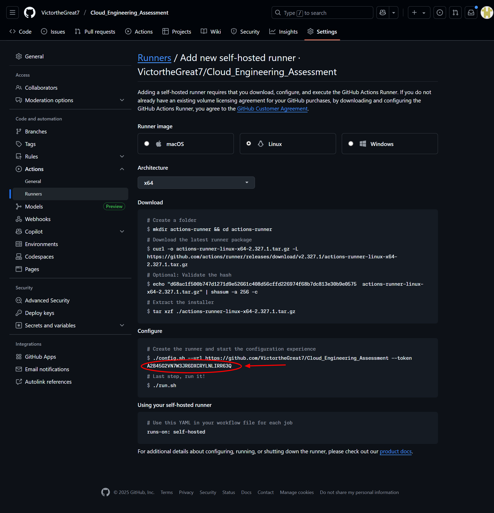

# Full-Stack World Clock Web App Infrastructure Project

A cloud-native infrastructure project that deploys a simple World Clock Dashboard App to Digital Ocean Kubernetes Service (DOKS)

This project is designed to demonstrate cloud and site reliability engineering skills, in concepts like Infrastructure as Code (IaC), containerization, container orchestration, monitoring, and automated continuous integration and deployment.

## 🏗️ Architecture Overview

This project demonstrates a deployment of a simple API written in Python that returns the current UTC time of various locations around the world and a Vite frontend that displays them. It includes the use of the following:

- **API**: Simple Flask API that returns current UTC time for various locations
- **Frontend**: Vite application that displays the current of several timezones using data from the API
- **Containerisation**: Docker for containerisation and local testing
- **Cloud Infrastructure**: Digital Ocean for compute, networking and managed Kubernetes service
- **Orchestration**: Kubernetes (K8s) for container orchestration and testing for production environments. kubectl and Helm for K8s resource management and deployment
- **Networking**: Virtual Network, Load Balancer and Firewall. Including NGINX Ingress Controller within K8s for ingress traffic management
- **Continuous Integration and Deployment (CI/CD)**: GitHub Actions for automated infrastructure provisioning and application deployment
- **Monitoring**: kube-prometheus-stack (Prometheus, Alertmanager and Grafana), Grafana Tempo, and Grafana Loki for observability (metrics. logs and traces) and alerting
- **Security**: GitHub Secrets, Digital Ocean Firewall
- **Infrastructure as Code**: The use of Terraform for provisioning and maintaining infrastructure state. cloud-init and Bash scripting for other automation purposes
- **SSL/TLS**: Cert Manager for automatic SSL/TLS certificate provisioning from Let's Encrypt

## 📋 Prerequisites

Before getting started, ensure you have installed and configured the following tools and services for your local machine and CI/CD environment:

### Required Tools

- [Digital Ocean CLI](https://docs.digitalocean.com/reference/doctl/how-to/install/)
- [GitHub CLI](https://cli.github.com/)
- [Terraform](https://www.terraform.io/downloads.html)
- [Docker](https://docs.docker.com/get-docker/)

### Required Accounts & Services

- **Digital Ocean Account** with a student or paid subscription and appropriate permissions. You will need to [generate an API token](https://docs.digitalocean.com/reference/api/create-personal-access-token/) with write permissions.
- **Docker Hub Account** as a container registry
- **GitHub Repository** for version control and CI/CD automation
- **Cloudflare Account** for DNS services. Your domain will need to be [managed by Cloudflare](https://developers.cloudflare.com/fundamentals/manage-domains/). You will need to [generate an API token](https://developers.cloudflare.com/api/tokens/create/) with DNS edit permissions for your domain.
- **HCP Terraform Account** (optional) for remote state management. Recommended for collaborative environments. You will need to [generate an API token](https://cloud.hashicorp.com/user/settings/tokens) with appropriate permissions.

## 🚀 Quick Start

### 1. Fork and Clone the Repository

Fork this repository to your GitHub account

### 2. Clone the fork to your local machine or use Codespaces

```bash
git clone https://github.com/VictortheGreat7/self-hosted-full-stack.git YOUR-REPO-NAME/
cd YOUR-REPO-NAME
```

### 3. Login to required CLI tools

Ensure you have the required tools installed as per the [Prerequisites](#-prerequisites) section.

Create a service principal for GitHub Actions:

```bash
# Login to Digital Ocean
doctl auth init -t YOUR_DIGITAL_OCEAN_API_TOKEN

# Login to GitHub CLI using the browser. Authenticate and copy one-time OAuth code to clipboard
gh auth login --web --clipboard

# Login to Terraform CLI (if using HCP for remote state)
terraform login
```

### 4. Configure GitHub Secrets

Set up the required GitHub repository secrets. You can use the provided script in the terraform/scripts

```bash
cd terraform/scripts
chmod +x gh_secret.sh
# Edit the script with your secret values first
./gh_secret.sh
```

**Required Values/Secrets**:

- `TF_API_TOKEN`: [Terraform API token](https://developer.hashicorp.com/terraform/cloud-docs/users-teams-organizations/api-tokens) (if using HCP for remote state)
- `GITHUB_RUNNER_TOKEN`: GitHub Actions runner token for the self-hosted runner. Find out how [`here`](https://docs.github.com/en/actions/how-tos/manage-runners/self-hosted-runners/add-runners). The cloud-init file for the runner vm already follows the instructions listed. All you need to do is copy the time-limited token with ./config.sh in the configure step. Just make sure you select Linux x64 architecture 
- `DO_API_TOKEN`: Digital Ocean API token with appropriate permissions
- `CLOUDFLARE_TOKEN`: [Cloudflare API token](https://developers.cloudflare.com/api/tokens/create/) with DNS edit permissions
- `CLOUDFLARE_ZONE_ID`: [Cloudflare Zone ID](https://developers.cloudflare.com/fundamentals/account/find-account-and-zone-ids/) for your domain
- `DOCKER_USERNAME`: Docker Hub username
- `DOCKER_PASSWORD`: Docker Hub password

### 5. Update Configuration

Edit the following files with your specific details:

#### `terraform/.tf`

```hcl

```

### 6. Deploy Infrastructure

Uncomment or add on-push trigger in .github/workflows/build.yaml and ensure other workflows will not trigger on push (except the app is up and you need to apply changes will integrate.yaml).

```yaml
on:
  push:
    branches:
      - main
```

Push your changes to trigger the GitHub Actions workflow:

```bash
git add .
git commit -m "[YOUR COMMIT MESSAGE]"
git push origin main
```

The build workflow will:

1. Check for changes in the backend and frontend directories to determine if new Docker images need to be built and pushed to Docker Hub
2. If there are changes, build, test and push new Docker images to Docker Hub
3. Provision base infrastructure (virtual network, firewalls and bastion for self-hosted Actions runner) on Digital Ocean using Terraform
4. Provision a Digital Ocean Kubernetes cluster using Terraform on a self-hosted runner

**Important**: You can only connect to the cluster from your self-hosted runner. There is also an ssh command in the outputs printed after a successful `terraform apply` that you can use to connect to the self-hosted runner for any sort of troubleshooting or the other.

## 🔧 Local Application/Image Building and/or Testing

### Running the Application Locally

```bash
# Backend
cd backend
pip install -r requirements.txt
python app.py

# Frontend (in a new terminal)
cd frontend
npm install
npm run dev
```

Access the application
Frontend: `http://localhost:5173` (or the port shown in terminal)
API: `http://localhost:5000/world-clocks`

### Building and Testing Docker Image

```bash
# Build the backend image
cd backend
docker build -t kronos:backend .
docker run -d -p 5000:5000 --name kronos-backend-local kronos:backend

# Build the frontend image
cd frontend
docker build -t kronos:frontend .
docker run -d -p 5173:80 --name kronos-frontend-local kronos:frontend

# Test the endpoint
curl http://localhost:5000/world-clocks
# and access http://localhost:80 in your browser to check frontend

# Clean up
docker stop kronos-frontend-local
docker stop kronos-backend-local
docker rm kronos-frontend-local
docker rm kronos-backend-local
```

## 📊 Monitoring and Observability

The project includes comprehensive monitoring:

- **Grafana**: For visual monitoring with dashboards
- **Prometheus**: For metrics scraping
- **Grafana Alloy**: For telemetry collection
- **Grafana Loki**: For log aggregation
- **Grafana Tempo**: Distributed tracing backend
- **Alertmanager**: Alerting based on defined rules

Access your Grafana dashboard through the ingress host. After authenticating kubectl cluster access on the bastion, run kubectl get ing -n monitoring to get the hosta address.

## 🔒 Security Features

- **GitHub Secrets**: Secure storage of sensitive tokens
- **VNet Firewalls**: Digital Ocean Network-level security
- **Private Cluster**: 

## 🛠️ Troubleshooting

### Useful Commands

```bash

# Check application status
kubectl get all -n time-api

# View logs
kubectl logs -f deployment/time-api -n time-api
```

## 🧹 Cleanup

To destroy all Terraform resources:

**Using GitHub Actions**: Trigger the "Destroy Infrastructure" workflow manually from the GitHub Actions tab.

**Note**: This will permanently delete all Digital Ocean resources created with `terraform apply`.

## 📝 Project Structure

```txt
digital-ocean-full-stack/
├── .github/
│   └── workflows/                                    # GitHub Actions CI/CD workflows
│       ├── build.yaml                                # Workflow for building from scratch
│       ├── destroy.yaml                              # Cleanup workflow
│       └── integrate.yaml                            # Workflow for subsequent infrastructure/deployment changes
├── backend/                                          # Flask Time API backend
│   ├── routes/                                       # API route definitions
│   │    ├── __init__.py                              # Blueprint initialization
│   │    ├── health.py                                # Health check endpoint
│   │    ├── time.py                                  # Blueprint initialization
│   │    └── traces.py                                # Blueprint initialization
│   ├── app.py                                        # Flask Time API logic
│   ├── config.py                                     # Configuration management
│   ├── db.py                                         # Database connection and models (if needed)
│   ├── Dockerfile                                    # Backend container image definition
│   ├── helpers.py                                    # Helper functions for the API
│   ├── metrics.py                                    # Prometheus metrics definitions
│   ├── requirements.txt                              # Python dependencies
│   └── telemetry.py                                  # OpenTelemetry backend tracing setup
├── frontend/                                         # Vite React frontend
│   ├── public/                                       # Static assets
│   │   └── vite.svg                                  # Vite logo
│   ├── src/                                          # React source code
│   │   ├── assets/                                   # Images and other assets
│   │   │   └── react.svg                             # React logo
│   │   ├── components/                               # React components
│   │   │   ├── CityCard.css                          # City card styles
│   │   │   ├── CityCard.jsx                          # City card component
│   │   │   ├── ClockOrbit.css                        # Clock orbit animation styles
│   │   │   ├── ClockOrbit.jsx                        # Clock orbit component
│   │   │   ├── Dashboard.css                         # Dashboard styles
│   │   │   └── Dashboard.jsx                         # Dashboard component
│   │   ├── App.css                                   # Application styles
│   │   ├── App.jsx                                   # Main App component
│   │   ├── index.css                                 # Global styles
│   │   ├── main.jsx                                  # Application entry point
│   │   └── tracing.js                                # OpenTelemetry frontend tracing setup
│   ├── .env                                          # Local environment variables
│   ├── .env.production                               # Production environment variables
│   ├── .gitignore                                    # Frontend-specific Git ignore rules
│   ├── Dockerfile                                    # Frontend container image definition
│   ├── eslint.config.js                              # ESLint configuration
│   ├── index.html                                    # HTML template
│   ├── nginx.conf                                    # NGINX configuration for production
│   ├── package-lock.json                             # Node.js dependencies lock file
│   ├── package.json                                  # Node.js dependencies and scripts
│   ├── README.md                                     # Frontend documentation
│   └── vite.config.js                                # Vite build configuration
├── manifests/                                        # Kubernetes manifests
│   ├── chaos-testing/                                # Chaos testing resources (K6 load testing)
│   │   ├── helm/                                     # Helm folder for K6 load testing
│   │   │   └── values.yaml                           # Helm values for K6 load testing
│   │   ├── scripts/                                  # Helper scripts for chaos testing
│   │   │   └── loadtest.js                           # K6 load testing script
│   │   ├── k6-test-script.yaml                       # K6 custom resource definition for load testing
│   │   ├── k6-testrun.yaml                           # K6 test run definition
│   │   └── kronos-slos-prometheusrule.yaml           # Prometheus SLOs and alerting rules for the World Clock application
│   ├── ingress/                                      # Ingress controller resources (NGINX Ingress Controller)
│   │   ├── cert-manager/                             # Cert Manager resources for TLS certificate management
│   │   │   └── values.yaml                           # Helm values for Cert Manager
│   │   ├── gateway/                                  # Kubernetes Gateway API resources for ingress routing
│   │   │   └── gateway.yaml                          # Helm values for Gateway API
│   │   ├── clusterissuer-letsencrypt-prod.yaml       # ClusterIssuer resource for Let's Encrypt production certificates
│   │   └── clusterissuer-letsencrypt-staging.yaml    # ClusterIssuer resource for Let's Encrypt staging certificates
│   ├── kronos-app/                                   # World Clock application Kubernetes resources
│   │   ├── backend-deployment.yaml                   # Kubernetes Deployment for the backend API
│   │   ├── backend-hpa.yaml                          # Kubernetes Horizontal Pod Autoscaler for the backend API
│   │   ├── backend-service.yaml                      # Kubernetes Service for the backend API
│   │   ├── db-configmap.yaml                         # Kubernetes ConfigMap for database configuration (if needed)
│   │   ├── db-service.yaml                           # Kubernetes Service for the database (if needed)
│   │   ├── db-statefulset.yaml                       # Kubernetes StatefulSet for the database (if needed)
│   │   ├── frontend-deployment.yaml                  # Kubernetes Deployment for the frontend
│   │   ├── frontend-hpa.yaml                         # Kubernetes Horizontal Pod Autoscaler for the frontend
│   │   ├── frontend-service.yaml                     # Kubernetes Service for the frontend
│   │   ├── httproute-http.yaml                       # Kubernetes HTTPRoute for ingress routing to the application
│   │   └── httproute-https.yaml                      # Kubernetes HTTPRoute for ingress routing to the application with TLS
│   ├── monitoring/                                   # Monitoring stack Kubernetes resources
│   │   ├── datadog/                                  # Datadog agent resources (if using Datadog for monitoring)
│   │   │   ├── helm/                                 # Helm folder for Datadog agent
│   │   │   │   ├── crds/                             # Custom resource definitions for Datadog agent
│   │   │   │   │   └── values.yaml                   # Helm values for Datadog CRDS
│   │   │   │   └── values.yaml                       # Helm values for Datadog agent
│   │   ├── kube-prometheus-stack/                    # kube-prometheus-stack resources for monitoring and alerting
│   │   │   ├── helm/                                 # Helm folder for kube-prometheus-stack
│   │   │   │   └── values.yaml                       # Helm values for kube-prometheus-stack
│   │   └── otel-configmap.yaml                       # ConfigMap for OpenTelemetry Collector configuration
│   └── reflector/                                    # Kubernetes resources for the Reflector component (if needed)
│       └── values.yaml                               # Helm values for the Reflector component
├── screenshots/                                      # Project screenshots and documentation images
├── terraform/                                        # Infrastructure as Code (IaC) and automation
│   ├── migrated/                                     # Terraform K8s resources migrated to ArgoCD
│   │   ├── app_backend.tf                            # Backend application deployment resources (ArgoCD migrated)
│   │   ├── db.tf                                     # Database deployment resources (ArgoCD migrated)
│   │   ├── frontend.tf                               # Frontend application deployment resources (ArgoCD migrated)
│   │   ├── gateway.tf                                # Gateway API resources for ingress routing (ArgoCD migrated)
│   │   ├── loadtest.tf                               # Load testing resources using K6 (ArgoCD migrated)
│   │   ├── monitoring.tf                             # Monitoring and observability stack (ArgoCD migrated)
│   │   └── tls.tf                                    # TLS certificate management using Cert Manager (ArgoCD migrated)
│   ├── scripts/                                      # Helper automation scripts
│   │   ├── gh_secret.sh                              # GitHub secrets management script
│   │   ├── loadtest.js                               # K6 load testing script
│   │   └── loadtest.py                               # Python load testing script
│   ├── .terraform.lock.hcl                           # Terraform dependency lock file
│   ├── backend.tf                                    # Terraform remote state backend configuration
│   ├── data.tf                                       # Data sources for existing resources
│   ├── dns.tf                                        # DNS configuration using Cloudflare
│   ├── kcd.tf                                        # ArgoCD application definitions for Kubernetes resource management
│   ├── main.tf                                       # Main Terraform entry point (AKS cluster, resource groups, etc.)
│   ├── netpolicy.tf                                  # Kubernetes network policies
│   ├── network.tf                                    # Cloud networking configuration (VNet, Firewalls)
│   ├── outputs.tf                                    # Terraform output definitions
│   ├── providers.tf                                  # Terraform provider configurations
│   ├── secrets.tf                                    # Terraform configuration for managing secrets
│   ├── terraform.tfvars.json                         # Terraform variable values (auto-generated from GitHub secrets)
│   └── variables.tf                                  # Terraform variable definitions
├── .gitignore                                        # Root Git ignore rules
└── README.md                                         # Project documentation
```

## 🤝 Contributing

1. Fork the repository
2. Create a feature branch: `git checkout -b feature-name`
3. Make your changes and commit: `git commit -am 'Add feature'`
4. Push to the branch: `git push origin feature-name`
5. Submit a pull request

## 🆘 Support

If you encounter issues:

1. Check the [Troubleshooting](#️-troubleshooting) section
2. Review the GitHub Actions logs
3. Check Digital Ocean portal for resource status
4. Open an issue in this repository

## 🔗 Useful Links

- [Digital Ocean Documentation](https://docs.digitalocean.com/)
- [Docker Documentation](https://docs.docker.com/)
- [GitHub Actions Documentation](https://docs.github.com/en/actions)
- [Terraform Documentation](https://registry.terraform.io/)
- [Terraform Digital Ocean Provider](https://registry.terraform.io/providers/digitalocean/digitalocean/latest/docs)
- [Terraform Kubernetes Provider](https://registry.terraform.io/providers/hashicorp/kubernetes/latest/docs)
- [Terraform Helm Provider](https://registry.terraform.io/providers/hashicorp/helm/latest/docs)
- [Terraform kubectl Provider](https://registry.terraform.io/providers/alekc/kubectl/latest/docs)
- [Terraform NGINX Ingress Controller Module](https://registry.terraform.io/modules/terraform-iaac/nginx-controller/helm/latest)
- [Digital Ocean Kubernetes Service Documentation](https://docs.digitalocean.com/products/kubernetes/)
- [Kubernetes Documentation](https://kubernetes.io/docs/)
- [Let's Encrypt Documentation](https://letsencrypt.org/docs/)

---

**Disclaimer**: This project is designed for learning and demonstration purposes. For production use, consider additional security hardening, cost optimization, and compliance requirements specific to your organization.
