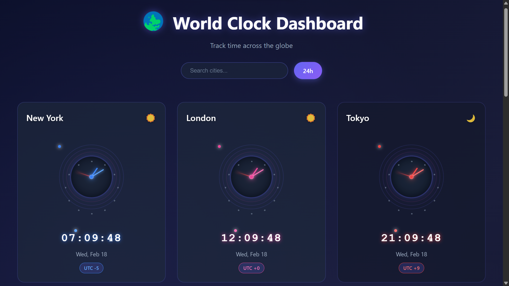
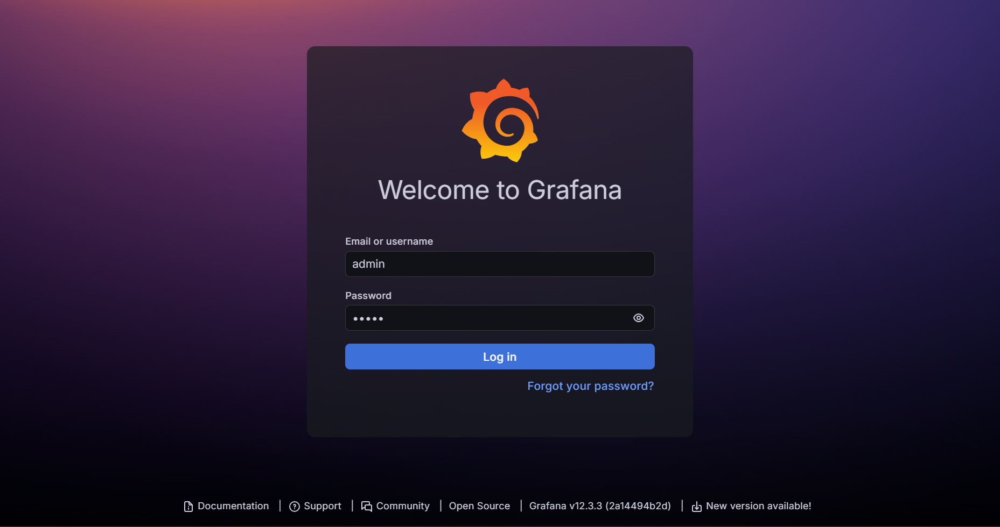

# Cloud Native Infrastructure Project

 

## 🚀 Project Overview: What Is This?

This project is a cloud-native infrastructure setup that can deploy applications to Digital Ocean Kubernetes Service (DOKS). It's an attempt at building an environment to host scalable and reliable applications in the cloud.

The app it's currently setup to host features a React frontend for displaying real-time world clocks and a Flask backend API for handling time zone data. The app pulls time zone info and displays it in a dashboard.



## 💡 Motivation: Why Did I Build This?

I created this project to "git gud" in cloud engineering and site reliability engineering (SRE) while building something practical. As someone looking to transition into DevOps or cloud roles, I wanted to simulate real-world scenarios: building a full-stack app from scratch, continuous integration, automating deployments, loadtesting and ensuring observability.

I'm trying to learn how tools fit together in a production-like environment, rather than just tinkering with them in isolation. This project is a sandbox for me to experiment with Kubernetes, Terraform, CI/CD pipelines, monitoring stacks, and security best practices—all while building something that has a tangible output (the world clock dashboard).

## 🛠️ Tech Stack: What Tools Am I Using and Why?

Here's a breakdown of the key technologies, grouped for clarity, with rationale for each choice:

| Category | Tools | Why? |
| ---------- | ------- | ------ |
| **Frontend** | React (with Vite), JavaScript | Sonnet decided that |
| **Backend** | Python, Flask | Sonnet also decided thaty |
| **Containerization** | Docker | Popular containerization tool |
| **Orchestration** | Kubernetes (DOKS), Helm, kubectl | I'm trying to build exertise here |
| **Infrastructure** | Terraform, Digital Ocean CLI | For Terraform, I have the most experience using HCL. For Digital Ocean, I had free credits (still stuck with a 3 droplet limit though) |
| **CI/CD** | GitHub Actions | It can help automate builds, tests, and deploys on every push/PR. It's free and built into where I keep my code |
| **Monitoring & Observability** | Prometheus, Grafana, Datadog, OpenTelemetry | Prometheus collects metrics efficiently; Grafana visualizes them in dashboards. As for Datadog, also had a free account just sitting so I am also testing a SaaS offering |
| **Networking & Security** | Cilium Gateway, Cert Manager (Let's Encrypt), Digital Ocean Firewall, Cloudflare DNS | Cilium Gateway routes traffic securely; Cert Manager automates SSL for HTTPS. Firewall for cloud level security and Cloudflare for DNS |
| **Testing** | K6 (for chaos testing) | Simulates load and failures to test resilience |

### ✨ Features

- Automated infrastructure provisioning and app deployment.
- Monitoring dashboards for metrics, logs, and traces.
- Secure HTTPS access with auto-renewing certificates.
- Chaos testing to simulate outages and verify resilience.

## 🏗️ Getting Started: How to Spin Up the Project?

Follow these steps to set up locally or deploy to Digital Ocean. Prerequisites: Docker, Node.js, Python, Terraform, kubectl, Helm, and accounts/API keys for Digital Ocean, Docker Hub, Cloudflare, and GitHub.

### Running the Application Locally

```bash
# Backend
cd backend
pip install -r requirements.txt
flask run

# Frontend (in a new terminal)
cd frontend
npm install
npm run dev
```

Access the application
Frontend: `http://localhost:5173` (or the port shown in terminal)
API: `http://localhost:5000/world-clocks`

### Building and Testing Docker Image

```bash
# Build the backend image
cd backend
docker build -t kronos:backend .
docker run -d -p 5000:5000 --name kronos-backend-local kronos:backend

# Build the frontend image
cd frontend
docker build -t kronos:frontend .
docker run -d -p 5173:80 --name kronos-frontend-local kronos:frontend

# Test the endpoint
curl http://localhost:5000/world-clocks
# and access http://localhost:80 in your browser to check frontend

# Clean up
docker stop kronos-frontend-local
docker stop kronos-backend-local
docker rm kronos-frontend-local
docker rm kronos-backend-local
```

### Manual Cloud Deployment

```bash
# Login to Digital Ocean
doctl auth init -t YOUR_DIGITAL_OCEAN_API_TOKEN

# Login to Terraform CLI (if using HCP for remote state). Edit the remote state configuration in terraform/backend.tf to your organization and workspace name too
terraform login
```

```json
// Update Terraform variables in terraform/terraform.tfvar.json
{
   "region": "YOUR_DESIRED_DIGITAL_OCEAN_REGION",
   "do_token": "YOUR_DIGITAL_OCEAN_API_TOKEN",
   "cloudflare_api_token": "YOUR_CLOUDFLARE_API_TOKEN",
   "cloudflare_zone_id": "YOUR_CLOUDFLARE_ZONE_ID",
   "datadog_api_key": "YOUR_DATADOG_API_KEY",
   "datadog_app_key": "YOUR_DATADOG_APP_KEY",
   "postgres_pass": "YOUR_CHOSEN_POSTGRES_PASSWORD",
   "subdomain": "YOUR_DESIRED_SUBDOMAIN", // e.g. "kronos" if you want kronos.yourdomain.com
   "domain": "YOUR_DOMAIN", // e.g. "mywonderworks.tech"
   "email": "YOUR_EMAIL_FOR_ACME_CERTS"
}
```

### Automated Cloud Deployment

```bash
# Login to GitHub CLI using the browser. Authenticate and copy one-time OAuth code to clipboard
gh auth login --web --clipboard

# Set up the required GitHub repository secrets. You can use the provided script in the terraform/scripts
cd terraform/scripts
chmod +x gh_secret.sh
```

**Required Values/Secrets**:

- `TF_API_TOKEN`: [Terraform API token](https://developer.hashicorp.com/terraform/cloud-docs/users-teams-organizations/api-tokens) (if using HCP for remote state)
- `DOCKER_USERNAME`: Docker Hub username
- `DOCKER_PASSWORD`: Docker Hub password
- `DO_API_TOKEN`: Digital Ocean API token with appropriate permissions
- `CLOUDFLARE_TOKEN`: [Cloudflare API token](https://developers.cloudflare.com/api/tokens/create/) with DNS edit permissions
- `CLOUDFLARE_ZONE_ID`: [Cloudflare Zone ID](https://developers.cloudflare.com/fundamentals/account/find-account-and-zone-ids/) for your domain
- `DATADOG_API_KEY`: [Datadog API key](https://docs.datadoghq.com/account_management/api-app-keys/#create-an-api-key-and-an-application-key)
- `DATADOG_APP_KEY`: [Datadog Application key](https://docs.datadoghq.com/account_management/api-app-keys/#create-an-api-key-and-an-application-key)
- `POSTGRES_PASS`: A strong password for the PostgreSQL database

```bash
# Edit the script with your secret values first
./gh_secret.sh
```

```yaml
# To deploy, uncomment or add on-push trigger in .github/workflows/build.yaml and ensure other workflows will not trigger on push (ditto for .github/workflows/integrate.yaml after the first build).
on:
  push:
    branches:
      - main
```

```bash
# Push your changes to trigger the GitHub Actions workflow
git add .
git commit -m "[YOUR COMMIT MESSAGE]"
# Make sure you forked the repo and set the remote to your fork before pushing
git push origin main
```

The build workflow will:

1. Check for changes in the backend and frontend directories to determine if new Docker images need to be built and pushed to Docker Hub
2. If there are changes, build, test and push new Docker images to Docker Hub
3. Provision a Digital Ocean Kubernetes cluster with helm releases for Cert-Manager, Gateway, Kubernetes Reflector, External DNS and ArgoCD applictions using Terraform

## 📸 Screenshots/Demo

  


## 🔮 Future Improvements & Lessons Learned

### Improvements

- Display all available clocks on the dashboard.
- Set up useful alerts and notifications.
- Optimize costs with auto-scaling.

### Lessons
